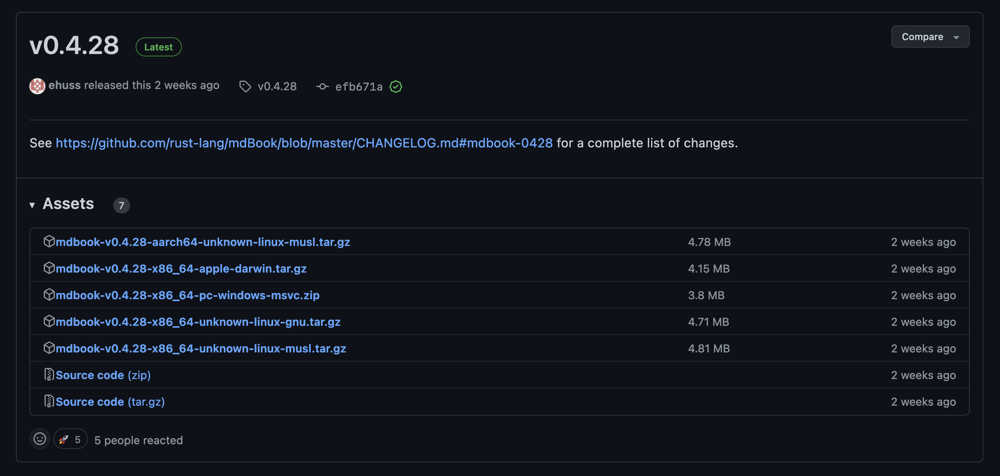

# Installation

[Installation - mdBook Documentation](https://rust-lang.github.io/mdBook/guide/installation.html)

mdBookのインストール方法は次の3種類があります。

- ビルド済みのバイナリを入れる方法
- Rustソースをビルドする方法

それぞれの方法について詳しく見ていきます。サンプルコマンドはM1 Macbook Airでの動作例です。

## ビルド済みのバイナリを入れる方法

具体的な方法は次の通りです。

1. [最新のReleaseページ](https://github.com/rust-lang/mdBook/releases/latest)を開く
2. バイナリの圧縮ファイルをダウンロードする
3. 生成されたバイナリファイルを`PATH`が通っている場所に置く

↓は2023/03/21時点で最新のリリース([v0.4.28](https://github.com/rust-lang/mdBook/releases/tag/v0.4.28))のページです。



まずは`curl`で適切なバイナリをダウンロードします。

```bash
curl -sSLO https://github.com/rust-lang/mdBook/releases/download/v0.4.28/mdbook-v0.4.28-x86_64-apple-darwin.tar.gz
```

ダウンロードが完了したら`tar`で展開します。

```bash
tar -xvf mdbook-v0.4.28-x86_64-apple-darwin.tar.gz
```

`mdbook`という実行ファイルができます。このファイルを`PATH`が通っているフォルダ内に置けば完了です。

```bash
mv mdbook /somewhere/
```

(ちなみにこの実行ファイルはx86_64アーキテクチャのmacで動作するものですが、私のM1 Macbookでも動作しました。調べるのが面倒なので理由については触れません。誰か教えてください)

## Rustソースをビルドする方法

この方法ではRustのツールチェインが必要になります。詳細は[Install Rust - Rust Programming Language](https://www.rust-lang.org/tools/install)を確認してください。

M1 Macbookでは次のコマンドでRustツールチェインをインストールできます。

```bash
curl --proto '=https' --tlsv1.2 -sSf https://sh.rustup.rs | sh
```

ツールチェインのインストールが完了したら、`cargo install`コマンドでmdBookをインストールします。

```bash
cargo install mdbook
```

このコマンドでは[crates.io](https://crates.io/)にリリースされている中で最新のRustソースがダウンロードされ、それがローカルでビルドされて適切な場所(`~/.cargo/bin`など)に置かれます。古いバージョンを指定したい場合は次のようにします。

```bash
cargo install mdbook@0.4.20
```

この例では[v0.4.20のmdBook](https://github.com/rust-lang/mdBook/releases/tag/v0.4.20)がインストールされます。

リポジトリのソースでビルドを行うには次のように`cargo install`を実行します。

```bash
cargo install --git https://github.com/rust-lang/mdBook.git mdbook
```

`cargo install`のより詳細な解説については[cargo install - The Cargo Book](https://doc.rust-lang.org/cargo/commands/cargo-install.html)を参照してください。
