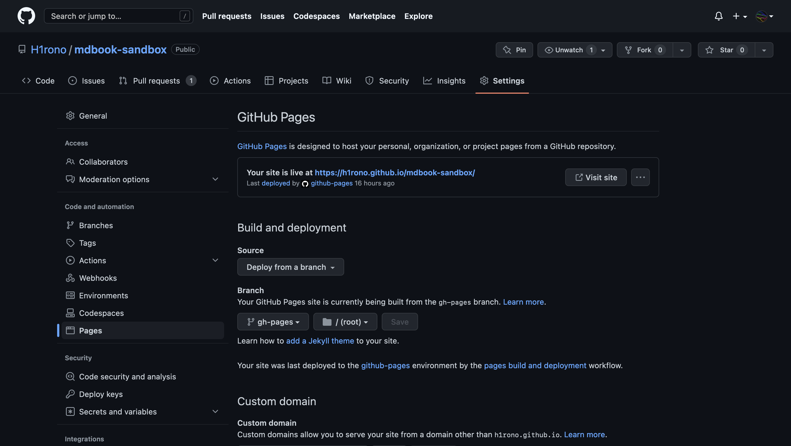

# GitHub Actions

- [Continuous Integration - mdBook Documentation](https://rust-lang.github.io/mdBook/continuous-integration.html)
- [MichaelCurrin/mdbook-quickstart: Starter template for an online book or docs site made with Markdown and mdBook 🦀 📙](https://github.com/MichaelCurrin/mdbook-quickstart)

[GitHub Actions](https://docs.github.com/en/actions)を用いて自動的にmdBookのビルドを行い、さらに[GitHub Pages](https://docs.github.com/en/pages)にデプロイするCIを紹介します。なお、[jobのrunner](https://docs.github.com/en/actions/using-jobs/choosing-the-runner-for-a-job)は`ubuntu-latest`(2023/3/23時点では`ubuntu-22.04`)であるものとします。

## CIでmdBookを使う方法

[Continuous Integration - mdBook Documentation #Pre-compiled binaries](https://rust-lang.github.io/mdBook/continuous-integration.html#pre-compiled-binaries)

[Installation](./02-installation.md)で紹介したようにmdBookはビルド済みの実行ファイルをリリースページからダウンロードできるため、ここではそれを使用する方法を紹介します。この方法は`cargo install`に比べて圧倒的に早く、CIにキャッシュを設定する必要もありません。

次のコマンドで`bin`ディレクトリ以下に実行ファイル`mdbook`が作成されます。

```bash
mkdir bin
curl -sSL https://github.com/rust-lang/mdBook/releases/download/v0.4.28/mdbook-v0.4.28-x86_64-unknown-linux-gnu.tar.gz | tar -xz --directory=bin
```

mdBookのバージョン指定を環境変数`MDBOOK_VERSION`にまとめることで、後ほどCIで使用するmdBookのバージョンを上げる際に設定ファイルの一箇所のみを変えればいいようにできます。

```bash
export MDBOOK_VERSION="v0.4.28"
curl -sSL https://github.com/rust-lang/mdBook/releases/download/${MDBOOK_VERSION}/mdbook-${MDBOOK_VERSION}-x86_64-unknown-linux-gnu.tar.gz | tar -xz --directory=bin
```

このようにして得た実行ファイルは、**`cd`でディレクトリを移動しない限りは**`bin/mdbook`のように参照できます。つまり、この実行ファイルでmdBookのビルドを行うには次のようにします。

```bash
bin/mdbook build
```

## mdBookの成果物を記録

[mdbook-quickstart/main.yml at main · MichaelCurrin/mdbook-quickstart](https://github.com/MichaelCurrin/mdbook-quickstart/blob/main/.github/workflows/main.yml)

[peaceiris/actions-gh-pages](https://github.com/peaceiris/actions-gh-pages)を使用すると、特定ディレクトリ以下のファイル全てをリポジトリの`gh-pages`ブランチにプッシュすることができます。以下はこのアクションを使用して、`books`ディレクトリ以下をプッシュする設定例です。

```yml
      - name: Deploy to GitHub Pages
        uses: peaceiris/actions-gh-pages@v3
        with:
          github_token: ${{ secrets.GITHUB_TOKEN }}
          publish_dir: book
```

ただし、このアクションはリポジトリへの書き込みを行っているため、次のようにワークフローの権限を設定する必要があります。(権限に関する説明は[Assigning permissions to jobs - GitHub Docs](https://docs.github.com/en/actions/using-jobs/assigning-permissions-to-jobs)を参照してください。)

```yml
permissions:
  contents: write
```

これで無事に成果物が`gh-pages`ブランチにプッシュされるようになります。このブランチをGitHub Pagesにデプロイするためには別の設定が必要になりますが、それに関しては後ほど説明します。

## ワークフロー全体の設定

ここまでに解説した内容で次のようなワークフローファイルが出来上がります。

```yml
name: GH Pages Deploy

on:
  push:
    branches:
      - main

env:
  MDBOOK_VERSION: v0.4.28

permissions:
  contents: write

jobs:
  build-deploy:
    runs-on: ubuntu-latest
    needs: check-changes

    steps:
      - name: Checkout
        uses: actions/checkout@v3
      - name: Install dependencies
        run: |
          mkdir -p bin
          curl -sSL https://github.com/rust-lang/mdBook/releases/download/${MDBOOK_VERSION}/mdbook-${MDBOOK_VERSION}-x86_64-unknown-linux-gnu.tar.gz | tar -xz --directory=bin
      - name: Build
        run: bin/mdbook build
      - name: Deploy to GitHub Pages
        uses: peaceiris/actions-gh-pages@v3
        with:
          github_token: ${{ secrets.GITHUB_TOKEN }}
          publish_dir: book
```

この本を開発しているリポジトリでは上記のYAMLにもう少し設定を加えたものを使用しています。実際のファイルは[mdbook-sandbox/gh-pages.yml at main · H1rono/mdbook-sandbox](https://github.com/H1rono/mdbook-sandbox/blob/main/.github/workflows/gh-pages.yml)を参照してください。

## 成果物をデプロイする設定

[Configuring a publishing source for your GitHub Pages site - GitHub Docs](https://docs.github.com/en/pages/getting-started-with-github-pages/configuring-a-publishing-source-for-your-github-pages-site)

ここまでの内容で、リポジトリの`main`ブランチに変更が加わる度にmdBookのビルドが自動的に行われ、その成果物が`gh-pages`ブランチにプッシュされるようになりました。この節では、`gh-pages`ブランチをGitHub Pagesにデプロイするために必要な設定を紹介します。

設定の方法は以下の通りです。

1. GitHubリポジトリのページを開く
2. **Settings** タブに移動する
3. **Pages** を選択する
4. **Build and Deployment** の項目を設定する
    - **Source** は **Deploy from a branch**
    - **Branch** は **gh-pages** の **/(root)**

以下は設定画面のスクリーンショットです。


