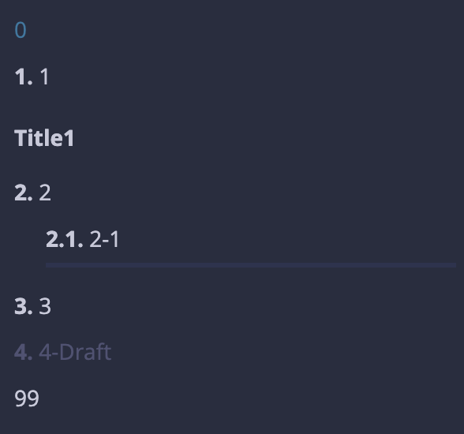

# SUMMARY.md

[SUMMARY.md - mdBook Documentation](https://rust-lang.github.io/mdBook/format/summary.html)

SUMMARY.mdはbook.tomlと同様、mdbookドキュメント生成時に作成されるファイルです。book.tomlはドキュメント全体の設定を記述するのに対して、SUMMARY.mdはドキュメントの構造、章立てを定義します。

## 構造

以下はSUMMARY.mdの記述例です。

```markdown
<!-- Title -->
# Summary

<!-- Prefix chapter -->
[0](ch0.md)

<!-- Numbered chapter -->
- [1](ch1.md)

<!-- Part title -->
# Title1

- [2](ch2.md)
    - [2-1](ch2-1.md)

<!-- Separator -->
---

- [3](ch3.md)
- [4-Draft]()

<!-- Suffix chapter -->
[99](fin.md)
```

このようなSUMMARY.mdでドキュメントを生成すると、チャプターの表示は次のようになります。



## 構成パーツ

- `Title`: SUMMARY.md自体のタイトルです。`# Summary`が一般的らしいです。
- `Prefix chapter`: ドキュメント「本体」の前に入れるチャプターです。Abstract, Introductionのような何か
- `Numbered chapter`: ドキュメント「本体」です。ネストすることもできます。
- `Part title`: ドキュメントの区切りとして入れられるタイトルです。
    - これ`##`始まりにしてもいいんじゃないかと思ったんですけどだめでした。markdownが`h1`だらけになるのは気持ち悪いですが、まあ仕方ないですかね...
- `Separator`: 区切りの横線です。
- `Suffix chapter`: ドキュメント「本体」の後に入れるチャプターです。Referenceなど
